<h1 align="center">Hi, I'm Rohit Kulkarni 👋</h1>
<h3 align="center">Gameplay Programmer | Unity Developer | Engine & Graphics Enthusiast</h3>

  I'm a software engineer with a background in gameplay systems, Unity development, graphics rendering, and engine-level problem solving.
  I enjoy building polished player experiences, scalable gameplay architecture, and tools that make development smoother for teams.

  <a href="mailto:rohit.kulkarni.271197@gmail.com">Email</a> •
  <a href="https://www.linkedin.com/in/rohit-kulkarni-b2ba50174/">LinkedIn</a> •
  <a href="https://github.com/rohitkulkarni97">GitHub</a> •
  <a href="https://github.com/RohitK-RIT">RIT Profile</a>

---

## About Me

- 🎓 MS in Game Design and Development from Rochester Institute of Technology
- 🎓 BE in Computer Science from Mumbai University
- 💼 Experience across open-source game development, mobile games, gameplay systems, and Unity-based production work
- 🛠️ Interested in gameplay programming, engine development, rendering, tools, and technical problem solving
- 🌱 Currently focused on writing cleaner systems, improving architecture, and growing toward deeper engine and gameplay engineering work
- 🎮 Currently playing **The Last of Us Part I**

---

## Tech Stack

**Languages**  
`C#` `C/C++` `GLSL` `HLSL`

**Tools & Engines**  
`Unity` `Unreal Engine` `Rider` `VS Code` `Visual Studio` `CLion`

**Focus Areas**  
Gameplay Programming • Unity Editor Tools • Engine Development • Graphics Rendering • System Architecture

---

## Experience Highlights

- [**Space Station 3D (Open Source)**](https://github.com/RE-SS3D/SS3D) — Volunteer Game Programmer
  Worked on Unity UI fixes, gameplay item systems, Input System improvements, and lifecycle correctness changes.

- **Dot9 Games** — Senior Software Developer  
  Contributed to **[FAU-G: Domination](https://play.google.com/store/apps/details?hl=en_US&id=com.dotnine.faug)**, a 3D mobile PvP FPS, where I worked on character animation, IK systems, and memory optimization using Unity Addressables.

- **Dot9 Games** — Software Developer  
  Worked on **[Ram Setu: The Run (Google Play)](https://play.google.com/store/apps/details?hl=en_US&id=com.dotnine.ramsetu)** and **[Ram Setu: The Run (App Store)](https://apps.apple.com/us/app/ram-setu-the-run/id1639509113)**, building mini-games, ad systems with AdMob mediation, memory/app-size optimizations, and supporting the iOS upload pipeline.

- **IDZ Digital Pvt. Ltd.** — Unity Developer  
  Built interactive systems for children’s games and contributed to titles such as **[Tizi Princess Home Design Game](https://play.google.com/store/apps/details?hl=en_US&id=com.iz.tizi.royal.princess.dollhouse.life.games.home.design.world.my.wonder.town)** and **[Tizi Town: My Space Games](https://apps.apple.com/us/app/tizi-town-my-space-games/id1475089280)**.  
  Also worked across multiple published titles on the **[IDZ Digital Google Play developer page](https://play.google.com/store/apps/dev?hl=en_US&id=5953899060857093739)**.

---

## Featured Projects

### [Warflux](https://github.com/RohitK-RIT/Flux-TimesUp/tree/dev)
Capstone project where I worked as a **Producer, Gameplay Programmer, and System Architect**, helping shape a stable, fun, and engaging gameplay experience.

### [Dynamic Duo](https://github.com/RohitK-RIT/601-Dynamic-Duo)
A couch co-op puzzle experience where I worked as **Tech Lead**, building robust and expandable gameplay systems.

### [Minimal Engine](https://github.com/urvashi1206/GameEngineDesign)
A research-driven attempt to build a **multi-threaded ECS game engine** with a rendering layer and Vulkan-based implementation.

### [Space Station 3D](https://github.com/RE-SS3D/SS3D)
Open-source Unity contributions spanning UI, gameplay systems, and input handling.

---

## Beyond Code

When I'm away from the keyboard, I usually spend time with:
- 🎸 Playing guitar
- 🎵 Listening to music
- 📚 Reading
- 🏋️ Working out
- ⚽ Football
- 🎮 Games that leave a lasting impression

---

## ⚙️ GitHub Analytics

  
  

---

## Let's Connect

I'm always open to connecting with people working on games, tools, rendering, gameplay systems, and interesting engineering problems.
